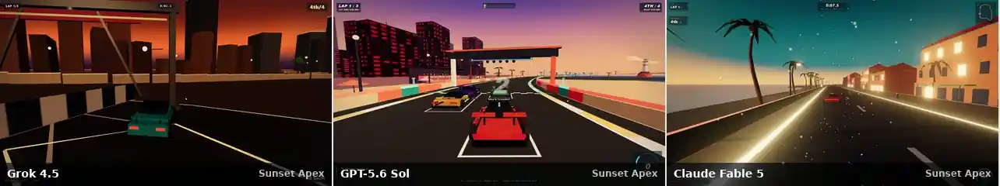
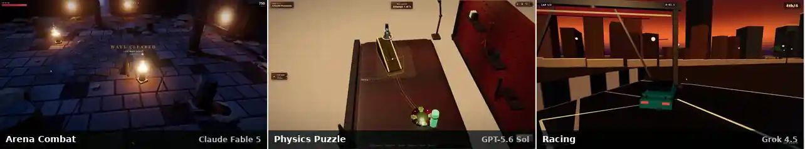
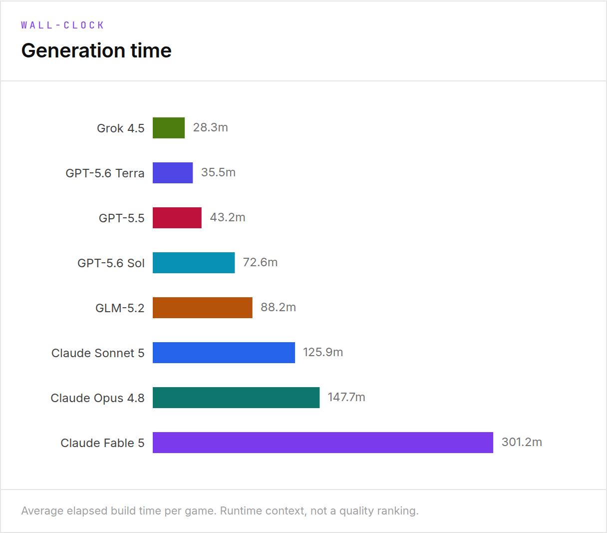
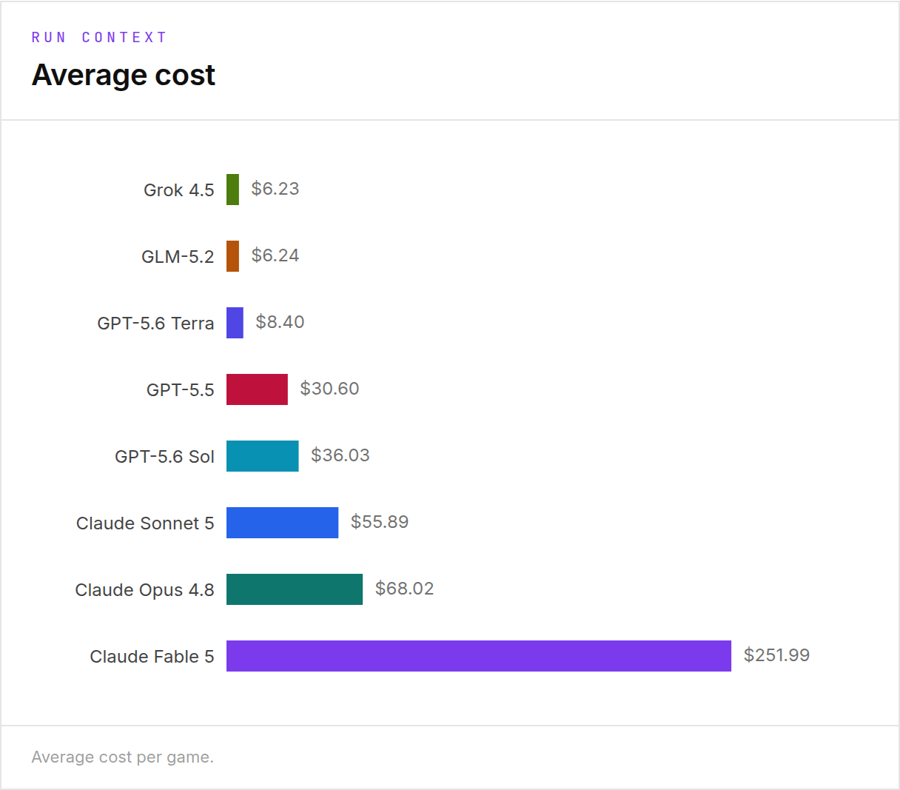
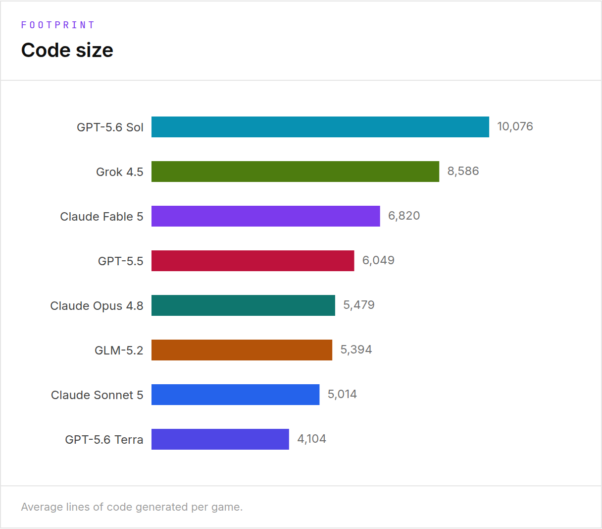
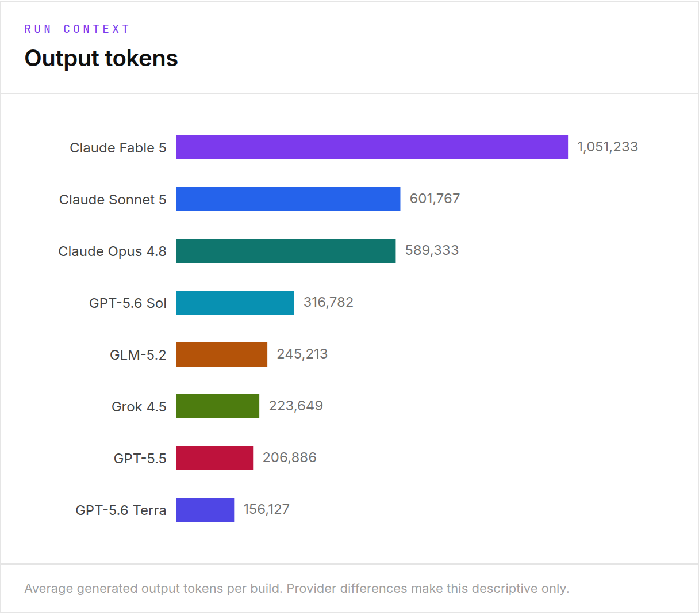

<div align="center">

# WorldBuild Bench

**Same brief, same tools, same harness. Build a 3D game someone would actually want to keep playing.**

[](LICENSE) [](package.json) [](models.json) [](https://sandscape.app/worldbuild/rounds/ai-game-benchmark-2026-07-13) [](https://sandscape.app/worldbuild)



<sub><b>One brief: <i>Sunset Apex</i>, a 3-lap circuit racer. Three models. Three completely different games.</b><br>
Real, unedited gameplay. All 24 builds from the round are playable in your browser right now.</sub>

### [▶ Play the builds](https://sandscape.app/worldbuild/rounds/ai-game-benchmark-2026-07-13) · [Vote in the Arena](https://sandscape.app/worldbuild/arena?round=ai-game-benchmark-2026-07-13) · [Methodology](https://sandscape.app/worldbuild/methodology) · [Round data](https://sandscape.app/worldbuild/data/ai-game-benchmark-2026-07-13)

</div>

---

## Why this exists

Coding benchmarks usually stop at "does it run." As models move toward "world models," a harder question is spatial, temporal, and causal coherence in a 3D space: does the model understand where things are, stay consistent over time, and when something happens, do the consequences make sense?

Those qualities are hard to capture with static benchmark questions. A game can compile, render, hit 60fps, pass every automated check, and still be something no human would play for thirty seconds. Games are a good vehicle for testing whether a model can hold a world together with space that stays coherent, causes that have effects, controls that feel like something.

WorldBuild Bench holds the harness constant so the model is the only variable: same system prompt, same tools and skills, same Three.js + Rapier scaffold, same Playwright playtest loop. The agent loop is ~300 lines of provider-agnostic TypeScript on raw `fetch` adapters with no provider SDKs, no vendor coding CLIs. Runs that go through each model's own coding agent measure the scaffold as much as the model; a result here should be attributable to the model.

## The three tasks

Each brief is a short GDD (~30 lines) that pins the game's name, setting, aesthetic, feel, and core loop, so differences between builds measure execution, not divergent taste in game design.



| Task | Brief | The hard part |
|---|---|---|
| **Arena Combat** | *Last Stand at the Ruin* — fight escalating waves of melee enemies in a closed arena until every wave is cleared or you die. | Enemy AI, wave pacing, and an arena that contains the player. |
| **Physics Puzzle** | *The Marble Works* — manipulate objects under gravity to get a ball into a goal zone across a sequence of levels. | Physics that resolve, and levels that are actually solvable. |
| **Racing** | *Sunset Apex* — race a vehicle against AI opponents over 3 laps on a closed track with checkpoints. | A track that closes, checkpoints in order, opponents that drive it. |

## The July 2026 pilot round

The first round runs eight models on the same three briefs (arena combat, physics puzzle, racing). That produced **24 browser-playable 3D games**. Every run shipped a build that loads and runs.
[Play them all →](https://sandscape.app/worldbuild/rounds/ai-game-benchmark-2026-07-13)

Claude Fable 5 · Claude Opus 4.8 · Claude Sonnet 5 · GLM-5.2 · GPT-5.5 · GPT-5.6 Sol ·
GPT-5.6 Terra · Grok 4.5

More open-source models are planned; cost (especially after running Fable) is prohibitive for now. All models ran in high thinking mode through this harness, with the same prompt, the same subagents, and the same basic setup (Three.js, Rapier, Playwright).

### Automated gates aren't enough

The objective gates passed nearly everything, while humans opening the same builds hit obvious problems: unsolvable levels, laps that never counted, controls that fought back. If automated scores don't track what a player notices in ten seconds, they're measuring the wrong thing.

So generation time, cost, code size, and the gate scores are published as useful information and diagnostics, **not as quality / benchmark scores**. None of them tells you whether a game is actually good.

Because those qualities are difficult to score automatically, the main evaluation is a blind **WorldBuild Arena**. You play two games built from the same brief without seeing the model names, then compare them on overall preference, game feel, world design, presentation, and completeness. Ratings are fit with a Bradley-Terry model on an Elo-like scale with bootstrap confidence intervals, and stay provisional until every model has at least 50 counted comparisons. Once there are enough comparisons, the site will publish the human-preference ratings.

**Rankings aren't published yet — voting is open.**
[Cast a blind vote →](https://sandscape.app/worldbuild/arena?round=ai-game-benchmark-2026-07-13)

## Build context

How long each model took, what it cost, and how much code it wrote. Published for transparency and not as a quality signal.

Cost varied a lot: Fable averaged ~$252 per game (over half the round's ~$1,390 spend), Opus ~$68, Sol ~$36, and GLM / Grok ~$6 each.

<table>
<tr>
<td width="50%"></td>
<td width="50%"></td>
</tr>
<tr>
<td width="50%"></td>
<td width="50%"></td>
</tr>
</table>

## Scoring

Two machine-computed scores per run (full details in [docs/methodology.md](docs/methodology.md)):

| Score | What it measures |
|---|---|
| **Playability Score** (0–100) | Weighted objective checklist: loads without fatal errors, WebGL canvas, visibly renders, input changes state, stable FPS, restart works, telemetry contract present |
| **World Coherence Score** (0–100) | Scripted probes over `window.__bench`: finite player position (no NaN / infinite falls), sane camera, entity queries, state evolution, reset semantics |

The human-preference **Arena Rating** and the composite **WorldBuild Rating** come from public voting at [sandscape.app/worldbuild](https://sandscape.app/worldbuild). They are not produced by this repo. This harness produces the objective half of the leaderboard and the playable games that feed the arena.

## Quickstart

```bash
git clone https://github.com/sebnado/worldbuild-bench
cd worldbuild-bench
npm install
npm run fetch-three            # populate scaffold/lib/three (gitignored)
npx playwright install chromium

cp .env.example .env           # fill in the keys for the models you want to run
                               # (wb loads .env automatically; no export needed)

npx tsx src/cli.ts models      # the registry
npx tsx src/cli.ts tasks       # the task briefs
npx tsx src/cli.ts run --task <task> --model claude-sonnet-5 --budget-usd 5 --budget-mins 20
npx tsx src/cli.ts gate runs/<run-id>          # re-score an existing run
npx tsx src/cli.ts report --round july-2026    # merge runs into a round JSON
```

Or build once and use the `wb` bin: `npm run build && node dist/cli.js --help`.

## Architecture

```
                        ┌──────────────────────────────┐
   models.json ───────► │  providers/                  │  direct fetch, no SDKs
   (id, pricing, env)   │  anthropic | openai* | google│  *openai adapter serves any
                        └──────────────┬───────────────┘   OpenAI-compatible baseURL
                                       │ ChatRequest/ChatResponse
                        ┌──────────────▼───────────────┐
   skills/ ───indexed──►│  agent/                      │  system + messages → provider
   (SKILL.md name+desc) │  loop · budget · transcript  │  → tool calls → results → repeat
                        └──────────────┬───────────────┘  worst case reserved per call
                                       │ tool calls
                        ┌──────────────▼───────────────┐
                        │  tools/                      │  bash · read/write/edit/list · update_tasks
                        │  (jailed to the workspace)   │  spawn_agent (parallel, depth ≤ 2)
                        └──────────────┬───────────────┘  test_game · play_game (headless playtests)
                                       │
                        ┌──────────────▼───────────────┐
   tasks/<slug>/TASK.md │  runs/<ts>-<task>-<model>/   │  workspace seeded from scaffold/
   scaffold/ + lib/  ──►│  workspace · transcript.jsonl│  (import map → bundled three.js)
                        │  result.json · screenshots/  │
                        └──────────────┬───────────────┘
                                       │
                        ┌──────────────▼───────────────┐
                        │  bench/gates.ts              │  Playability Score 0–100
                        │  (Playwright chromium)       │  World Coherence Score 0–100
                        └──────────────────────────────┘
```

- **Skills** (`skills/*/SKILL.md`): practical guides indexed by name + description into
  the system prompt; the model reads the full file with `read_file` when needed.
- **Subagents**: `spawn_agent` gives the model fresh-context workers in the same
  workspace; multiple calls in one reply run concurrently. The root agent is prompted as
  an orchestrator: a dedicated PRD subagent designs the game first (`prd` skill), then
  parallel module builders execute its build plan, then the orchestrator integrates,
  playtests, and runs a polish pass (`subagents` + `game-quality` skills).
- **Telemetry contract**: every game must expose `window.__bench`
  (`getState / reset / getPlayerPosition / getCameraInfo / getEntities /
  getObjectiveStatus`) — the coherence probes consume it, and its absence caps the
  Playability Score.
- **Interactive playtesting**: `test_game` is the fixed health probe; `play_game`
  executes a model-scripted gameplay session (clicks, drags, key holds, waits, in-page
  evals, screenshots) and snapshots `window.__bench` after every action with a
  `state_changed` flag — so models verify cause and effect, not just looks.
- **Task tracking**: `update_tasks` keeps a per-agent task list (each call replaces the
  whole list) so models can plan multi-step work and keep the plan current.
- **Visual feedback**: `test_game` attaches its playtest screenshots (2s / post-input /
  10s JPEGs) — and `play_game` its requested captures — to the tool result for models
  flagged `vision` in `models.json`; text-only models get the identical JSON report
  without images. Whether a run was sighted is recorded in `result.json`
  (`model.vision`, `agent.images_sent`) — see the neutrality notes in
  [docs/methodology.md](docs/methodology.md).

## Adding a model

Add an entry to [models.json](models.json) — id, provider routing, pricing, and the env
var holding its key. Any OpenAI-compatible endpoint works via `base_url`.

| Variable | Used by |
|---|---|
| `ANTHROPIC_API_KEY` | `claude-*` models (Messages API) |
| `OPENAI_API_KEY` | `gpt-*` models (Responses API) |
| `GEMINI_API_KEY` | `gemini-*` models (generateContent) |
| `OPENROUTER_API_KEY` | OpenRouter-routed entries (glm / minimax / qwen / kimi / deepseek) |
| `GROQ_API_KEY` / `CEREBRAS_API_KEY` | optional — for registry entries you add pointing at Groq / Cerebras |
| `*_BASE_URL` (e.g. `ANTHROPIC_BASE_URL`) | optional endpoint overrides per provider |

## Notes

- The bash tool runs with a **sanitized environment**: only `PATH`, `LANG`, `LC_ALL`,
  `TERM`, `TZ`, and `NODE_ENV` are inherited from the parent process; `HOME` and `TMPDIR`
  point inside the workspace (so `~`/`$HOME` cannot reach your real home), and everything
  else — provider API keys, tokens, secrets — is dropped.
- The workspace jail (path checks + realpath symlink containment) remains a guardrail
  against accidental escapes, **not** a security sandbox. Run untrusted models inside a
  container.
- Runs are written to `runs/` (gitignored): workspace, JSONL transcript of every
  request/response/tool call, `result.json`, and screenshots.
- License: [MIT](LICENSE).

This is a first version, and the methodology will evolve. Critical feedback on any aspect is welcome.
